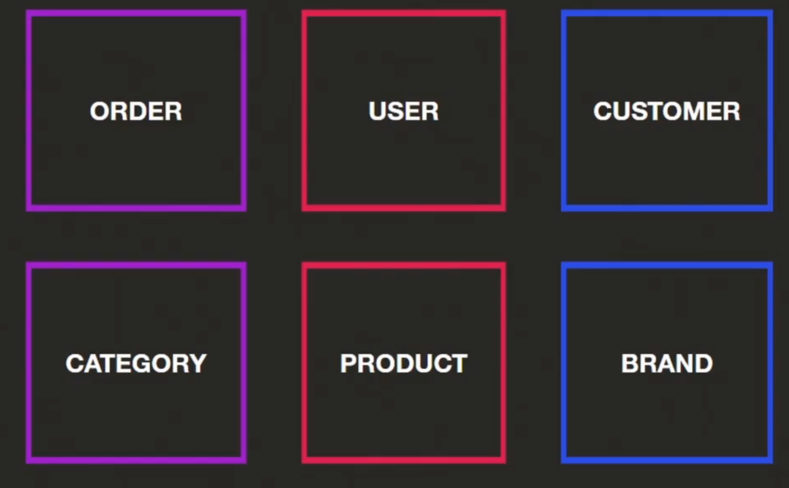
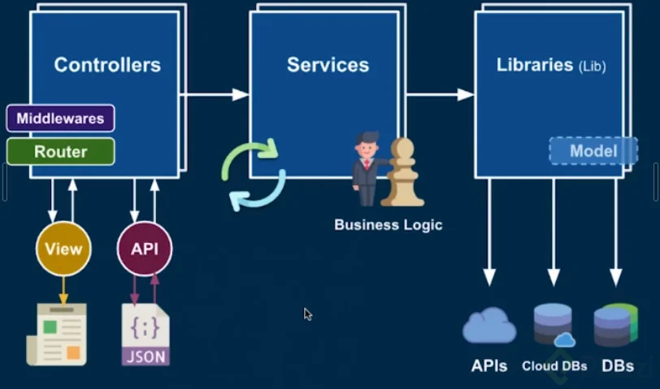
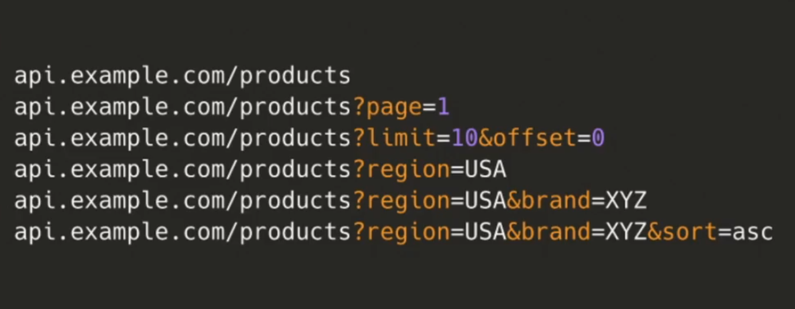
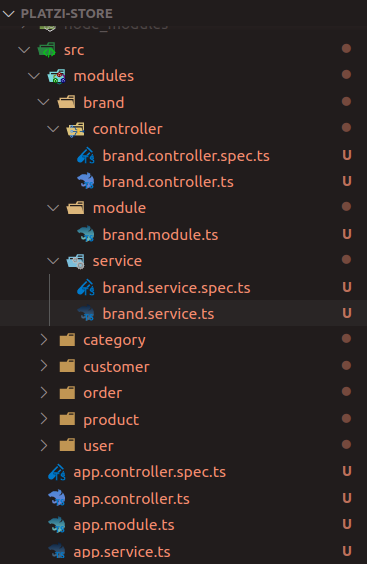

###### npm run start:dev
###### http://localhost:4444/hello

# Skills Backend

#### API REST, Inyeccion de dependencias, Programacion modular, Usevalue, UseFactory, validations,
#### Principios Single responsability, Solid, Typescript, POO, Programacion funcional, Programacion reactiva.

Command doc:

```js
	//! Install nestjs
	npm i -g @nestjs/cli 

	//! Nest new project
	nest new [ProjectName]

	//npm Install dependencies
	npm
	
	// Run ProjecName from ProjectName Dir
	npm run start

	// Run ProjecName MODE:DEVELOPER from ProjectName Dir
	npm run start:dev

	// Check project run in your localhost:4444
``` 
###### create controllers

```js
	// New controller in subDir
	nest g controller [nameController]

	// New controller without subDir
	nest g controller [controllers]/[nameController] --flat
```
###### create services 

```js
	// New service in subDir
	nest g s controller [nameService]

	// New controller without subDir
	nest g s controller [services]/[nameService] --flat
```
###### create pipe 

```js
	// New pipe
	nest g pipe [common]/[nameParse[typeof]Pipe]

```
###### class validator - class transform

```js
	npm i class-validator class-transformer
```

#### Commands


//! Comando para crear controlador en la carpeta controllers --flat= sin subcarpetas
//todo λ nest g controller controllers/products --flat

```js

//!┌─┐┌─┐┌┬┐┌─┐┌┐┌┌┬┐┌─┐┌─┐
//!│  │ ││││├─┤│││ │││ │└─┐
//!└─┘└─┘┴ ┴┴ ┴┘└┘─┴┘└─┘└─┘
//! Crear carpetas/moudulos
/*     //?mo
/*     //!co
/*     //?s */
nest g co modules/order/controller/order --flat
nest g mo modules/order/module/order --flat
nest g s modules/order/service/order --flat
nest g co modules/user/controller/user --flat
nest g mo modules/user/module/user --flat
nest g s modules/user/service/user --flat
nest g co modules/customer/controller/customer --flat
nest g mo modules/customer/module/customer --flat
nest g s modules/customer/service/customer --flat
nest g co modules/category/controller/category --flat
nest g mo modules/category/module/category --flat
nest g s modules/category/service/category --flat
nest g co modules/product/controller/product --flat
nest g mo modules/product/module/product --flat
nest g s modules/product/service/product --flat
nest g co modules/brand/controller/brand --flat
nest g mo modules/brand/module/brand --flat
nest g s modules/brand/service/brand --flat

//! controllers
nest g co controllers/orders --flat
nest g co controllers/users --flat
nest g co controllers/customers --flat
nest g co controllers/categories --flat
nest g co controllers/products --flat
nest g co controllers/brands --flat

//! services
   nest g s services/app --flat
&& nest g s services/products --flat
&& nest g s services/brands --flat
&& nest g s services/faqs --flat
&& nest g s services/customer --flat
&& nest g s services/users --flat

//! dtos
dto/brands.dtos.ts --flat
dto/customer.dtos.ts --flat
dto/faqs.dtos.ts --flat
dto/users.dtos.ts --flat

comando: nest g pi common/parse-int

npm i class-validator class-transformer
```

####	Un API ecomerce con:
```js

Entidades:
- Ordenes de compra
- Usuarios
- Categorías
- Productos
- Clientes
- Marcas

El API la podrás consumir desde Android o cualquier aplicación Frontend como Angular, React, etc

También lograremos tener la documentación de la API REST con Swagger.

```




### TypeScript

```ts
// Safe type
let name: string;
const age = 19;
const suma =(a: number, b:number)=> {
	return a + b;
}

// Classes
class Person {
  constructor(private age: number, private name: string) {}

  getSummary() {
		return `I'm ${this.name} and I'm ${this.age}`;
  }
}


```

##### Configuracion global autoformater

```js
Si desean evitarse formatear el código manualmente, pueden hacer que se autoformatee cada vez que se guarda el archivo, para esto pueden hacer lo siguiente:
Abrir configuración de VS en JSON
Preferences: Open Settings (JSON)
Añadir la siguiente línea, puede ser al final
"editor.formatOnSave": true
Adicional, también pueden configurar Prettier globalmente para que cuando guarden Prettier tome esa configuración


Super, tambien puedes agregar esta configuracion Por protector, en el archivo .vscode/settings.json

```

Problema donde eslint me indicaba que no podía leer el archivo tsconfig.json.

```js

// Dirigirme al archivo .eslintrc.js y buscar el apartado de parserOptions y indicarle que lo busque en el directorio de trabajo con tsconfigRootDir: __dirname

	parserOptions: {
		project: 'tsconfig.json',
			tsconfigRootDir: __dirname, //! <-- important!
			sourceType: 'module',
		}
```
Nest viene con prettier pre instalado y configurado con el archivo .prettierrc en este archivo podemos colocar opciones de configuración para que nuestro código quede con un buen formato un ejemplo podria ser el siguiente { "singleQuote": true, "trailingComma": "all", "printWidth": 60 } y ademas visual studio code se puede configurar para que aplique el formateo autormaticamente. solo basta con abrir o crear el archivo .vscode/settings.json y colocar estas opciones dentro { "editor.defaultFormatter": "esbenp.prettier-vscode", "prettier.printWidth": 60, "editor.formatOnSave": true, "prettier.requireConfig": true } } Asi cada vez que guardemos el archivo el pluggin prettier dará formato a los archivos

### Arquitechture

> Controllers
> Las funciones de un controlador son:

	- Procesar la peticion HTTP
	- Obtener los datos de entrada desde las distinta fuentes (body, params, query)
	- Validar los datos de entrada
	- Llamar al servicio correspondiente
	- Responder con una petición HTTP con la información solicitada o con la información del error que se produjo
	- Services
	- Son el corazón de nuestra api. No solo se encarga de conectar el controlador con las librerías sino que además, llama a otros servicios.
	- 
La lógica de negocio se centra en esta parte

> Libraries
Es la parte que se encarga de conectarse con las librerías externas. Librerias como bases de datos u otros apis.



> Metodos HTTP

	- POST => Crear
	- GET => Obtener
	- PUT => Editar
	- DELETE => Eliminar
	- Entre otros

**CONTROLADORES**

Los controladores son los componentes más importantes. Son los responsables de manejar las solicitudes entrantes y devolver las respuestas al cliente.

El mecanismo de enrutamiento gestiona qué controlador recibe qué solicitudes. cada controlador puede tener más de una ruta y cada ruta puede realizar diferentes trabajos.

Los enrutadores manejarán los métodos de nuestra RestAPI como GET , PUT , POST , DELETE , etc. solicitudes y respuestas salientes.


**DECORADORES**
“Los decoradores (decorators en inglés) son una propuesta para incluir en JavaScript que nos permite añadir anotaciones y metadatos o cambiar el comportamiento de clases, propiedades, métodos, parámetros y accesors.

Con TypeScript podemos usarlos activando la propiedad experimentalDecorators del tsconfig.json de nuestro proyecto o si decidimos compilar mediante el comando tsc, colocar siempre la opción de --experimentalDecorators —target ES5.”


### Endpoints

```ts
//Recuerda con / (slashes) o sin ellos los controladores de NestJS resuelven la ruta.

@Get('nuevo')  // 👈 Without slashes 
newEndpoint() {
  return 'yo soy nuevo';
}

@Get('/ruta/') // 👈 With slashes 
hello() {
  return 'con /sas/';
}

```

#### Other Example

```ts
import { Controller, Get } from '@nestjs/common';
import { AppService } from './app.service';

@Controller()
export class AppController {
	constructor(private readonly appService: AppService) {}

	@Get()
	getHello(): string {
		return this.appService.getHello();
	}

	// Rutas--links--Endpoints
	@Get('new')
	newEndPoint() {
		return `NewEndPoint`;
	}

	// Rutas--links--Endpoints. Tips Usar NombresEnPlurales
	@Get('/ruta/')
	SecondEndPoint() {
		return `2End/Point/`;
	}
}

```

#### Para obtener parámetros de la URL usas el decorador @Params

#### Query params



```ts
@Get('products/:productId')
getProduct(@Param('productId') productId: string) {
  return `product ${productId}`;
}
```

Nota: Utiliza los plurales para tus endpoints. Ejemplo:

api.example.con/tasks/
api.example.con/users/

Para obtener parámetros de la URL usas el decorador @Param

```ts


// Para obtener un parámetro:

@Get('products/:productId')
getProduct(@Param('productId') productId: string) {
  return product ${productId};
}

// Para obtener dos parámetros:

@Get('categories/:id/products/:productId')
getCategory(@Param('productId') productId: string, @Param('id') id: string) {
  return  product: ${productId} and categories: ${id};
}
```

Otra manera de recibir más de un parámetro

```ts

	@Get('categories/:categoryId/products/:productId')
  getCategory(@Param() {categoryId, productId}) {
    return `Product ${productId}, Category ${categoryId}`;
  }

```

Si desean recibir un parametro y hacer una prevalidación del mismo por ejemplo que debe ser un entero. Existen los pipe (estan más adelante) y uno simple es así:

```ts

@Get('products/:id')
  getProduct(
    @Param(
      'id',
      new ParseIntPipe({ errorHttpStatusCode: HttpStatus.NOT_ACCEPTABLE }),
    )
    id: number,
  ) {
    return `Product ${id}`;
  }

```

Por defecto todos estos archivos se crean en services desconoco si es una buena practica pero continue realizando los ejercicios de esta manera para poner una ruta dinamica consegui que funcionara de la siquiente manera
este es el archivo app.service.ts

```ts

import { Injectable, Param } from '@nestjs/common';

@Injectable()
export class AppService {
  getHello(): string {
    return 'Hello World!';
  }

  getNewEndpoint(): string {
    return 'New endpoint';
  }

  getPost(@Param('PostId') PostId: string): string {
    return `This action returns a #${PostId} `;
  }
}

```

y este el archivo app.controller.ts

```ts
import { Controller, Get, Param } from '@nestjs/common';
import { AppService } from './app.service';

@Controller()
export class AppController {
  constructor(private readonly appService: AppService) {}

  @Get()
  getHello(): string {
    return this.appService.getHello();
  }
  // new endpoint
  @Get('new')
  getNewEndpoint(): string{
    return this.appService.getNewEndpoint();
  }
  @Get('Posts/:PostId')
  getPost(@Param('PostId') PostId: string): string{
    return this.appService.getPost(`${PostId}`);
  }

}

```

Con el decorador @Query podemos recibir parámetros de consulta (Query Params) de una URL.

```ts
@Get('products')
getProducts(
  @Query('limit') limit = 100,
  @Query('offset') offset = 0,
  @Query('brand') brand: string,
) {
  return `products limit=> ${limit}`;
}
```

Otra forma de trabajar con los distintos params, aprofechando un poco lo que es ts:

```ts

interface: (fuera de la clase controller)

interface PaginateParams {
	limit?: number;
	offset?: number;
}


@Get()
	getCategories(@Query() params: PaginateParams): string {
		const { limit = 20, offset = 0 } = params;
		return `categoríes paginated with limit(${limit}) and offset(${offset})`;
	}
```

Al menos a mi me parece más limpia gracias al destructuring, o al menos me queda más comoda a la vista

Igual que en el @Param podemos usar Pipes.

```ts
@Get('products')
  getProducts(
    @Query(
      'limit',
      new ParseIntPipe({ errorHttpStatusCode: HttpStatus.NOT_ACCEPTABLE }),
    )
    limit = 100,
    @Query(
      'offset',
      new ParseIntPipe({ errorHttpStatusCode: HttpStatus.NOT_ACCEPTABLE }),
    )
    offset = 0,
    @Query('brand') brand: string,
  ) {
    return `Product: Brand->${brand} Limit->${limit}. Offset ->${offset}`;
  }
```

Parámetros tipo Query
Los parámetros tipo query o Query Params son una serie de clave-valor que se agregan al final de la URL, justo después del signo de interrogación (?).

```ts
https://myapi.com/customers?name=oscar
```

Algunos de los usos que le podemos dar a los query params pueden ser, para limitar la cantidad de registros que vamos a traer, realizar algún filtro, o para la paginación de nuestra respuesta, entre otros

Con el decorador @Query podemos recibir parámetros de consulta (Query Params) de una URL.

```ts

@Get('products')
getProducts(
  @Query('limit') limit = 100,
  @Query('offset') offset = 0,
  @Query('brand') brand: string,
) {
  return `products limit=> ${limit}`;
}

```

En caso que dentro de la URL no se encuentre el valor, se tomara el valor que asignamos en nuestro controller
Si no asignamos un valor inicial nos mostrara undefined
También podemos realizar la desestructuración para acceder a los valores.

```ts
@Get('products')
	getProduct(@Query() params: any){
		const { limit, offset } = params;
		return `product ${limit} ofset ${offset}}`
	}
```

Creo que así es un poco más prolijo

```ts

interface ProductsFindAllQueryParams {
  limit: number;
  offset: number;
}

@Get('/products')
  findAll(
    @Query() { limit = 100, offset = 0 }: ProductsFindAllQueryParams,
  ): string {
    return `Products Limit=>${limit} OffSet=>${offset}`;
  }
```

# Single responsability
Principio de una sola responsabilidad (SOLID) - Nest


Para crear controladores puedes usar el generador de código de NestJS con el siguiente comando:
nest g co controllers/categories --flat

```ts
//Caso: agregarlos los controladores por carpetas 😁

nest g co controllers/products
nest g co controllers/categories
nest g co controllers/brands
nest g co controllers/users
nest g co controllers/costumers
nest g co controllers/orders
```

### Arquitectura escalable

Codigo para una arquitectura de carpetas escalable, si en un futuro el proyecto tiene reviews o cualquier feature lo insertamos dentro de modules/review, ademas de poder incorporar DTOs e Interfaces dentro de estas subcarpetas.

```ts

nest g co modules/order/controller/order --flat
nest g mo modules/order/module/order --flat
nest g s modules/order/service/order --flat
nest g co modules/user/controller/user --flat
nest g mo modules/user/module/user --flat
nest g s modules/user/service/user --flat
nest g co modules/customer/controller/customer --flat
nest g mo modules/customer/module/customer --flat
nest g s modules/customer/service/customer --flat
nest g co modules/category/controller/category --flat
nest g mo modules/category/module/category --flat
nest g s modules/category/service/category --flat
nest g co modules/product/controller/product --flat
nest g mo modules/product/module/product --flat
nest g s modules/product/service/product --flat
nest g co modules/brand/controller/brand --flat
nest g mo modules/brand/module/brand --flat
nest g s modules/brand/service/brand --flat
```



```ts
// Puede ser útil para probar rápido desde la terminal los endpoints:
curl "localhost:3000/products?brand=platzi" 
```

####  Postman o insomnia

Para poder probar nuestra API de forma más productiva vamos a tener que usar algún cliente de APIs que nos permita hacer las pruebas de funcionamiento de lo que estás construyendo, los dos clientes más famosos son Insomnia y Postman y vas a necesitar de alguno de ellos para ir probando cada característica que vamos a ir construyendo en nuestro servicio de Platzi Store.

> Insomnia
Como cliente para probar APIs tiene grandes características, destaca principalmente por una interfaz limpia y sencilla, pero a la vez potente, en donde puede configurar ambientes, exportar e importar, gran soporte con GraphQL, etc. Insomnia será el que vamos a usar en este curso 🙂


> Instalación
La instalación es sencilla, solo tienes que ingresar a https://insomnia.rest/download y descargar el instalador. Una vez esté descargado lo ejecutas y sigues los pasos de la instalación; en caso de Windows descarga un archivo .exe, en caso de Mac descarga un .dmg, y finalmente, en caso de Ubuntu descargas el .deb.

> Postman

Es uno de los más usados y legendariamente nos ha acompañado por mucho tiempo, además cuenta con características similares a Insomnia como: exportar e importar, ambientes, entornos, y provee una API para hacer testing muy potente.

> Instalación Windows y Mac

La instalación es sencilla solo tienes que ingresar a https://www.postman.com/downloads/
y descargar el instalador, una vez esté descargado lo ejecutas y sigues los pasos de la instalación, en caso de Windows descarga un archivo .exe y en caso de Mac descargas un archivo comprimido lo descomprimes y ahí sigues el proceso.

> Instalación Linux

```ts
# Debian, Ubuntu y derivados
sudo apt install postman

# Arh, Manjaro
sudo pacman -S postman

# Fedora
sudo yam install postman
```

Para los que usamos una distro basada en Arch tenemos insomnia y/o postman a nuestra dispocion gracias al AUR

```ts
# Insomnia
yay -Syu insomnia

# Postman
yay -Syu postman
```

## Post

**METODO POST:** Es el método para creación de datos
Para utilizarlo en Nest.js debemos importar el decorador
La mejor forma de comunicar servicios es por el formato JSON

```ts
import { Controller, Post } from '@nestjs/common';

	//!Crear,Postear
	@Post()
	create(@Body() payload: CreateProductDto) {
		return this.productsService.create(payload);
	}
```
**payload** Se refiere a un conjunto de información necesaria para ejecutar algo… En este caso post payload, la información requerida para crear un objeto. Digamos que es una convención, en la empresa en la que trabajo la utilizan mucho. Un ejemplo más gráfico es la información que enviamos a un servidor por medio de un formulario eso sería payload, una traducción literal sería carga útil.


### PUT and DELETE

Estos dos métodos son increíbles , uno es para actualizar los datos y el otro es para eliminarlos

> PUT Este es el metodo para actualizar datos

¿Pero porque PUT y no Patch?
Aunque ambos métodos contienen un parecido significado son distintos , PUT es para hacer una actualización completa y PATCH es para una actualización parcial(por partes) .
Pero la mayoría de los devs lo utilizan PUT como PATCH
Cabe acalarar que este método usualmente va acompañado del body y de parámetros

> Entonces importamos:

```ts
import { Controller, Delete } from '@nestjs/common';
Y lo agregamos de la siguiente manera

@Put(':id')
  update(@Param('id') id: number, @Body() payload: any) {
    return {
      message: 'update method',
      id,
      payload,
    };
  }
```
> DELETE

Como su mismo nombre lo dice es el método para eliminar datos

Este método usualmente se acompaña de un parámetro mínimo

Importamos

```ts
import { Controller , Delete } from '@nestjs/common';
Definimos

@Delete(':id')
  delete(@Param('id') id: number) {
    return {
      message: 'Delete method',
      id,
    };
  }
```

### Codigos de estado

Con el decorador  @HttpCode puedes personalizar el status code para tus endpoints 😮

Bueno esta parte si eres nuevo , para que entres en contexto te recomiendo la siguiente pagina 

[Like_a_cat](https://http.cat/)

Nest nos permite utilizar nuestros propios estados , para esto debemos importar nuestro decorador HttpCode y opcionalmente HttpStatus

```ts
import {Controller,Post,HttpStatus,HttpCode} from '@nestjs/common';
//Y definir el código de estado

 @Post("rute")
  @HttpCode(code)
  create(@Body() payload: any) {
    return {
      message: 'acción de crear',
      payload,
    };
  }
```

Dije que HttpStatus es opcional ya que podemos definir el código de 2 maneras , numero o por las propiedades de HttpStatus

```ts
@HttpCode(HttpStatus.CREATED)
```
ó
```ts
@HttpCode(201)
```
###### Custom Response

```ts
@Get(':productsId')
@HttpCode(HttpStatus.ACCEPTED) getProduct( @Res() response: Response, @Param( 'productsId', ParseIntPipe,) productsId: number,) {
	return this.productsService.findOne(productsId);
}

```

Para mi no es recomendable usar la forma del decorador para devolver una respuesta. ¿qué pasa si buscas productos y no hay productos? para mi lo lógico seria regresar un 404 y un mensaje de “no se encontró información”. Esto a futuro ayuda muchisimo con las pruebas que se realicen a la API y en el desarrollo del front al interceptar todas las respuestas que se obtengan y manejarlas de forma más fácil.

> Resumen status code:
	- Informational responses (100–199)
	- Successful responses (200–299)
	- Redirects (300–399)
	- Client errors (400–499)
	- Server errors (500–599)

Nest utiliza internamente express, y se pueden manipular código directamente de express en nest, pero debería ser utilizado solo en casos bastantes puntuales

### Creando un servicio

Los servicios son una pieza esencial de las aplicaciones realizadas con el framework NestJS

<aside>
Están pensados para proporcionar una capa de acceso a los datos que necesitan las aplicaciones para funcionar.
</aside>

Un servicio tiene la responsabilidad de gestionar el trabajo con los datos de la aplicación, de modo que realiza las operaciones para obtener esos datos, modificarlos, etc.

> Con los servicios podemos:

> Aislar la lógica de negocio en una clase aparte
Reutilizar fácilmente el código de trabajo con los datos a lo largo de varios controladores
Para construir un servicio podemos usar el CLI de Nest. Para crear la clase de un servicio lanzamos el siguiente comando:

nest generate service products
```ts
nest g s products
```
Además también realiza automáticamente la modificación del archivo app.module.ts en el que se introdujo
```ts

/**
 * El decorador @injectable permite inyectarse en los controladores, todo servicio 
 * debe tener este decorador antes de la declaración de la clase que lo implementa para poder usar la inyección de dependencias:
 */
	
import { Injectable } from '@nestjs/common';

@Injectable()
export class ProductsService {}
```
#### Methodos

```ts
  findAll() { return this.products; }

  findOne(idProduct: number) {
    return this.products.find(product=> product.id === idProduct);
  }

  create(payload: any) {
    const product: Product = {
      id: this.counterId,
      ...payload,
    };
    this.products.push(product);
    this.counterId++;
  }

  update(id: number, payload: any) {
    let productFound = this.products.find(product=> product.id === id);
    if (productFound) {
      productFound = {
        id: id,
        ...payload,
      };
      return true;
    }
    return false;
  }

	update(id: number, payload: any) {
		const indexResult = this.products.findIndex(item=> item.id === id);
		if (indexResult) {
			const updatedItem = {
			...this.products[indexResult],
			...payload,
		};
		this.products[indexResult] = updatedItem;
		} else {
			throw new Error('There  is not item into products');
		}
	}

	update(id: number, payload: Product) {
    let updatedProduct: Product;
    this.products = this.products.map<Product>(product=> {
				if (id === product.id) {
					return updatedProduct = { ...product, ...payload };
				}
				return product;
			});
		return updatedProduct;
  }

	updateOne(id: number, product: ProductEntity): ProductEntity {
    const index = this.products.findIndex(p=> p.id === id);
    this.products[index] = product;
    return product;
  }

	edit(id: number, payload: any) {
    const productEdit = this.products.findIndex(p=> p.id === id);
    this.products[productEdit] = {
      id: id,
      ...payload,
    };
  }

  delete(id: number) {
    const productsFound = this.products.filter(product=> product.id !== id);
    if (productsFound.length != this.products.length) {
      this.products = productsFound;
      return true;
    }
    return false;
  }

  delete(id: number) {
    const productDelete = this.products.findIndex(p=> p.id === id);
    this.products.splice(productDelete, 1);
  }

	remove(id : number) {
		this.products = this.products.filter(item=> item.id != id);
	}

	deleteOne(id: number): ProductEntity {
    const index = this.products.findIndex(p=> p.id === id);
    const product = this.products[index];
    this.products.splice(index, 1);
    return product;
  }

  delete(id: number) {
    const productFound = this.products.findIndex(item=> item.id === id);
    let message = '';
    if (productFound > 0) {
      this.products.splice(productFound, 1);
      message = 'product deleted';
    } else {
      message = 'product not found';
    }
    return message;
  }

```

[inyeccion_de_dependencias](https://platzi.com/blog/inyeccion-de-dependencias-el-codigo-es-poder/)

[buenas_practicas_inyeccion_de_dependencias](https://platzi.com/blog/inyeccion-de-dependencias-el-camino-de-las-buenas-practicas/)


```ts
update(id: number, payload: any) {
	const product = this.findOne(id);
	if (product) {
		const productIndex = this.products.findIndex(p=> p.id === product.id);
		this.products[productIndex] = {
			...product
			...payload,
			id, // Agregar esta línea
		};

		return product;
	}
	return null;
}
```

Aporto mi implementación de servicio de Productos.
```ts

import { Injectable } from '@nestjs/common';
import { Product } from '../../entity/product.entity';

@Injectable()
export class ProductsService {
  private counterId: number;
  private products: Product[] = [
    {
      id: 1,
      name: 'Product 1',
      description: 'bla bla',
      price: 200,
      stock: 50,
      image: '',
    },
  ];
  constructor() {
    this.counterId = 1;
  }

  findAll() {
    return this.products;
  }

  findOne(id) {
    return this.products.find((item) => item.id === id);
  }

  create(payload: any) {
    this.counterId = this.counterId + 1;
    const newProduct = {
      id: this.counterId,
      ...payload,
    };
    this.products.push(newProduct);
    return newProduct;
  }

  update(payload: any, id: number) {
    const toEdit = this.findOne(id);
    const keys = Object.keys(payload);
    const values = Object.values(payload);
    let counter = 0;
    let temp = [];
    values.forEach((element) => {
      if (!element) {
        temp.push(counter);
        return counter++;
      }
      toEdit[keys[counter]] = values[counter];
      counter++;
    });
    return this.products;
  }

  erase(id: any) {
    const toErase = this.findOne(id);
    const index = this.products.indexOf(toErase);
    console.log(index, 'Erase method');
    return this.products.splice(index, 1);
  }
}

```

```ts
update(id: number, payload: any) {
		const User = this.findOne(id);
		const index = this.Users.indexOf(User);
		this.Users[index] = { ...this.Users[index], ...payload };
		return this.Users[index];
	}
delete(id: number) {
	const User = this.findOne(id);
	const index = this.Users.indexOf(User);
	this.Users.splice(index, 1);
	return true;
}
```

### Mensajes de ERROR

Otra forma de manejar excepciones es con el modulo HttpException seria algo asi

```ts
import { HttpException, HttpStatus } from '@nestjs/common';

// DENTRO DE TU SERVICIO O CONTROLLER
getProducts(){
	throw new HttpException('Error no se encontro', HttpStatus.BAD_REQUEST);
}
```

Ejemplo con HttpException retornando un NOT_FOUND

```ts
import { HttpException, HttpStatus, Injectable } from '@nestjs/common';
import { Product } from 'src/entities/product.entity';

// SERVICE
findOne(id: number) {
	const product = this.products.find(
		item=> item.id === id
	);

	if (!product)
		throw new HttpException(
			'Product not found',
			HttpStatus.NOT_FOUND
		);
	return product
}
```
HttpCode será nuestra respuesta por defecto, la cual esperamos sea positiva siempre, por ello se coloca como principal, sin embargo, con lo de las excepciones este httpCode será reemplazado por el error que hayamos lanzado. No le veo desventaja desde mi visión.


### Pipes
Los pipes tienen dos funciones principales validar y transformar.

Los pipes tienen dos casos de uso típicos:
transformación: transforma los datos de entrada a la forma deseada (por ejemplo, de cadena a entero)
validación: evalúe los datos de entrada y, si son válidos, simplemente páselos sin cambios; de lo contrario, lanza una excepción cuando los datos son incorrectos
Los pipes tienen dos funciones principales validar y transformar.


los middlewares y los pipes son similares en funcionamiento, sin embargo, los pipes se ejecutan en un orden de precedencia que esta mucho antes de llegar al request, mientras que el midleware esta solo justamente antes de entrar al end-point.

Puedes crear tus propios pipes para crear validaciones y transformaciones personalizadas.

[documentacion](https://docs.nestjs.com/pipes)
[pipes](https://docs.nestjs.com/pipes#built-in-pipes)


```ts

//Importarlo

import { ParseIntPipe, } from '@nestjs/common';
Implementarlo

@Get(':productId')
@HttpCode(HttpStatus.ACCEPTED)
getProduct(@Param('productId', ParseIntPipe) productId: number) {
  return this.productService.findOne(productId);
}
```

Custom pipes
Tambien se puede crear un pipe customizable:

```ts
//Con el comando: 

nest g pipe common/parse-int

//->CREATE src/common/parse-int.pipe.spec.ts (173 bytes)
//->CREATE src/common/parse-int.pipe.ts (224 bytes)
```
Crea el siguiente codigo del pipe

```ts
import { ArgumentMetadata, Injectable,PipeTransform, } from '@nestjs/common';

@Injectable()
export class ParseIntPipe implements PipeTransform {
  transform(value: string, metadata: ArgumentMetadata) {
    return value;
  }
}

//reescribiendo el parseInt:

import {
  ArgumentMetadata,
  Injectable,
  PipeTransform,
  BadRequestException,
} from '@nestjs/common';

@Injectable()
export class ParseIntPipe implements PipeTransform {
  transform(value: string, metadata: ArgumentMetadata) {
    const val = parseInt(value, 10);
    if (isNaN(val)) {
      throw new BadRequestException(`${value} is not number`);
    }
    return val;
  }
}
```

Agregue una validacion extra para el parseintpipe por que cuando ingresaba numeros con una letra o muchas letras no me lograba atrapar el error.

```ts
transform(value: string, metadata: ArgumentMetadata) {
	const val = parseInt(value, 10);

	if (isNaN(val) || /\D/.test(value)) {
		throw new BadRequestException(`${value} is not a number.`);
	}

	return val;
}
```

```ts
import {
	ArgumentMetadata,
	BadRequestException,
	Injectable,
	PipeTransform,
} from '@nestjs/common';

/*
?My own Pipe
?╔═╗┌─┐┬─┐┌─┐┌─┐╦┌┐┌┌┬┐╔═╗┬─┐┌─┐┌─┐┬┌─┐
?╠═╝├─┤├┬┘└─┐├┤ ║│││ │ ╠═╝├┬┘│ │├─┘││ │
?╩  ┴ ┴┴└─└─┘└─┘╩┘└┘ ┴ ╩  ┴└─└─┘┴  ┴└─┘
*/
@Injectable()
export class ParseIntPipe implements PipeTransform {
	transform(value: string, metadata: ArgumentMetadata) {
		const val = parseInt(value, 10);
		if (isNaN(val)) {
			throw new BadRequestException(`#${val} is not an number`);
		}
		return val;
	}
}


```


### Data transfer objects (DTO)

Valida la informacion

[dto](https://martinfowler.com/bliki/LocalDTO.html)

> Funciones de los DTOs:

Proteger los datos
Validar y tipar datos
Evita hacer referencia a datos que no existan

Los data transfers object o DTO por sus siglas, es una guía para que el desarrollador y aquellos que consumen la API sepan que de forma espera tener el cuerpo de la solicitud.
No ejecuta ninguna validación de clases es mas una guía

Creación de un DTO

Creamos una carpeta dtos en el cual creamos nuestro archivo products.dto.ts aqui vamos a especificar que campos van a obtener el cuerpo de la solicitud:

```ts
export class CreateProductDto {
	readonly name: string;
	readonly description: string;
	readonly price: number;
	readonly stock: number;
	readonly imag: string;
}
// Readonly: Indica que el campo no podrá ser editado.
// Y luego lo importamos en nuestro controlador o services:

import { CreateProductDto } from './../../dtos/products.dto'
@Post()
  create(@Body() payload: CreateProductDto) {
    return this.productsService.create(payload);
  }
```

```ts
npm i class-validator class-transformer @nestjs/mapped-types
```


#### Validar que los tipos coincidan con los DTOs

Instalar dependencias: npm install @nestjs/mapped-types class-validator class-transformer

Importar las dependencias en el main.ts
```ts

import { NestFactory } from '@nestjs/core';
import { ValidationPipe } from '@nestjs/common';
import { AppModule } from './app.module';

async function bootstrap() {
  const app = await NestFactory.create(AppModule);
  app.useGlobalPipes(new ValidationPipe());
  await app.listen(3000);
}
bootstrap();

//importar en el DTO:

import {
  IsString,
  IsNumber,
  IsUrl,
  IsNotEmpty,
  IsPositive,
} from 'class-validator';

import { PartialType } from '@nestjs/mapped-types';

// Implementar en la clase del DTO:

export class CreateProductDto {
  @IsString()
  @IsNotEmpty()
  readonly name: string;

  @IsString()
  @IsNotEmpty()
  readonly description: string;

  @IsNumber()
  @IsNotEmpty()
  @IsPositive()
  readonly price: number;

  @IsNumber()
  @IsNotEmpty()
  @IsPositive()
  readonly stock: number;

  @IsUrl() //valida que sea una url
  @IsNotEmpty()
  readonly image: string;
}
// Se puede extender a una clase pero que sea opcional pero que valida sus campos de esta forma:

export class UpdateProductDto extends PartialType(CreateProductDto) {}

// Se puede extender un mensaje custom al decorador
@IsString({message: 'My custom message'})
```

Si quieren agregar un campo en el DTO con tipo Date pueden hacer esto:
```ts

//Permiten la transformacion en el main.ts

  app.useGlobalPipes(new ValidationPipe({ transform: true }));

//Agregan @Type de la libreria class-transform
@IsDate()
@Type(() => Date)
@IsNotEmpty()
readonly date: Date;

// En el request pueden enviar varios formatos, por ej:
"date": "06/18/2021",
```
Con class-validator también tenemos la opción de retornar mensajes personalizados para cada una de las validaciones.

Solo basta con, en la validación que corresponda, agregar un objeto con la key message que contendra dicho mensaje.

### Evitando parametros incorrectos Inyecciones maliciosas DATA sanitization

Creo que prohibir datos que no se usan esta bien, aparte le va servir a las personas que consuman esa API. Ya que si tienen un typo enviando en el Body una propiedad, ejem: Enviar usename en vez de username. La API le avisara que no existe esa propiedad y le ahorraría la fatiga de encontrar el error que esta cometiendo 😅


Eliminar los parámetros recibidos que no estén definidos en los DTO
```ts

whitelist: true,

//Informar a la API que se está enviando un atributo no válido
forbidNonWhitelisted: true,
```

Hasta ahora en las request te pueden mandar otros campos que no correspondan con tu DTOs y los guarda.

Para evitar guardar esos campos tenemos que configurar en el main.ts el ValidationPipes las propiedad whitelist en true y si queremos ser restrictivos, tenemos que setear forbidNonWhitelisted en true

Implementacion con los cambios

```ts
async function bootstrap() {
  const app = await NestFactory.create(AppModule);
  app.useGlobalPipes(
    new ValidationPipe({
      whitelist: true,
      forbidNonWhitelisted: true,
    }),
  );
  await app.listen(3000);
}
```
> Con estos cambios, al momento de enviar un request, con un campo demas, vamos a obtener:

```ts
{
  "statusCode": 400,
  "message": [
    "property otro should not exist"
  ],
  "error": "Bad Request"
}
```
##### Es una decisión no tan fácil de tomar, dependiendo el contexto deberías decidir si avisar o no del dato incorrecto, ya que efectivamente ayuda mucho a quien consume la api pero también ayudará al hacker malicioso a determinar que puede y que no puede hacer. Recordemos que el hacker examina, prueba y explota.

¿Devolver el error de que un campo no existe no estaríamos diciéndole a alguien malicioso la estructura de nuestra db? -> true


¿Cómo puedo manipular el mensaje que devuelveforbidNonWhitelisted: true ?
```ts
{
  "statusCode": 400,
  "message": [
    "Quiero manipular este mensaje"
  ],
  "error": "Bad Request"
}
Jonatan
jdelgad
```

-> Con este pipe con forbidNonWhitelisted es de forma global, aunque class-validator si deja poner mensajes personalizados por cada campo ejemplo:

```ts
exportclassPost {
  @MinLength(10, {
    message: 'Title is too short',
  })
  @MaxLength(50, {
    message: 'Title is too long',
  })
  title: string;
}
```

[continuacion_en_README_MODULAR](#continuacion_en_readme_modular)
#### Si puedes poner un prefijo global a toda tu API, de esta manera:
```ts
const app = await NestFactory.create(AppModule);
app.setGlobalPrefix('v1');
```

<p align="center">
  <a href="http://nestjs.com/" target="blank"></a>
</p>

[circleci-image]: https://img.shields.io/circleci/build/github/nestjs/nest/master?token=abc123def456
[circleci-url]: https://circleci.com/gh/nestjs/nest

  <p align="center">A progressive <a href="http://nodejs.org" target="_blank">Node.js</a> framework for building efficient and scalable server-side applications.</p>
    <p align="center">
<a href="https://www.npmjs.com/~nestjscore" target="_blank"></a>
<a href="https://www.npmjs.com/~nestjscore" target="_blank"></a>
<a href="https://www.npmjs.com/~nestjscore" target="_blank"></a>
<a href="https://circleci.com/gh/nestjs/nest" target="_blank"></a>
<a href="https://coveralls.io/github/nestjs/nest?branch=master" target="_blank"></a>
<a href="https://discord.gg/G7Qnnhy" target="_blank"></a>
<a href="https://opencollective.com/nest#backer" target="_blank"></a>
<a href="https://opencollective.com/nest#sponsor" target="_blank"></a>
  <a href="https://paypal.me/kamilmysliwiec" target="_blank"></a>
    <a href="https://opencollective.com/nest#sponsor"  target="_blank"></a>
  <a href="https://twitter.com/nestframework" target="_blank"></a>
</p>
  <!--[](https://opencollective.com/nest#backer)
  [](https://opencollective.com/nest#sponsor)-->

## Description

[Nest](https://github.com/nestjs/nest) framework TypeScript starter repository.

## Installation

```bash
$ npm install
```

## Running the app

```bash
# development
$ npm run start

# watch mode
$ npm run start:dev

# production mode
$ npm run start:prod
```

## Test

```bash
# unit tests
$ npm run test

# e2e tests
$ npm run test:e2e

# test coverage
$ npm run test:cov
```

## Support

Nest is an MIT-licensed open source project. It can grow thanks to the sponsors and support by the amazing backers. If you'd like to join them, please [read more here](https://docs.nestjs.com/support).

## Stay in touch

- Author - [Kamil Myśliwiec](https://kamilmysliwiec.com)
- Website - [https://nestjs.com](https://nestjs.com/)
- Twitter - [@nestframework](https://twitter.com/nestframework)

## License

Nest is [MIT licensed](LICENSE).
