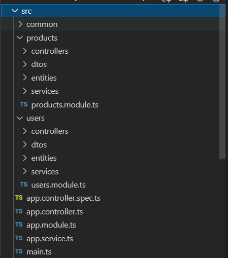
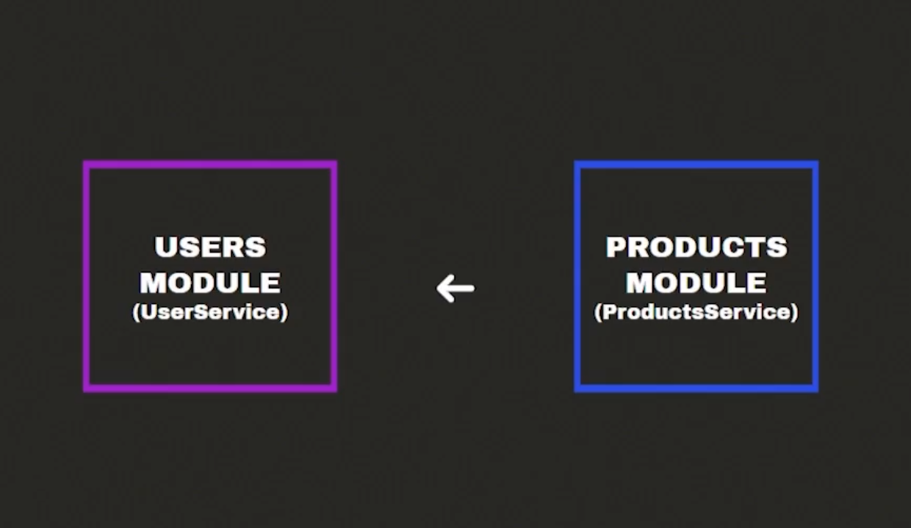

## Encapsular logica en modulos

La aplicación debería quedar organizada así:




Para crear controladores dentro de un modulo con el cli puedes usar esto:

```ts
nest g co controllers/users users
```

Entiendo que al modularizar por “Dominios” podemos ir facilmente a una arquitectura con microservicios 😄


Muy intersante. no estoy seguro si se pueda pasar a microservicios, tienes aun la dependencia del modulo principal. y los microservicios en realidad se comunican entre si por un message broker. esto es mas para no tener una inyeccion de dependencias por toda la aplicacion si solo la necesitas en un modulo. por ejemplo users no necesita en realidad el service de products


> La modularidad se refiere al proceso de dividir el sistema en varios módulos capa por capa de arriba a abajo cuando se resuelve un problema complejo

Dentro de cada carpeta crear las subcarpetas : controllers , entities, services, dtos

Decorador @Module que tiene 4 atributos: imports, controllers, providers y exports (este ultimo para conectar con otro modulo)

```ts
nest g mo modules/products --flat
nest g mo modules/users --flat
```
#### Así todos los módulos quedan dentro de la carpeta modules.

## Interaccion entre modulos

Para lograr usar el Servicio A que hace parte de Módulo A en el Módulo B debemos exportar el Servicio A y luego importar el  Módulo A en el Módulo B. 😮

Y Si alguna vez mientras desarrollan en NestJS y se encuentran con que a pesar de estar exportados e importados los módulos/servicios, y Nest les sigue pidiendo que los añadan, seguramente es porque ambos servicios están siendo llamados el uno al otro, en otras palabras, un círculo vicioso. Para esto Nest implementó la siguiente solución:

```ts

import { forwardRef } from '@nestjs/common';
import { ModuloUno } from 'modules/moduloUno.module';

@Module({
  imports: [
    forwardRef(() => ModuloUno), //? fordwardRef nos ayuda a que ambos servicios sean llamados recíprocamente
  ]})
Recuerden utilizar esto para ambos módulos, y también para ambos servicios.
```

Así quedaría cundo lo inyecten al servicio.

```ts
constructor(
	@Inject(forwardRef(() => ModuloUno))
	private moduloUno: ModuloUno,
) {}
```

El ejercicio real se haria con la entidad de customer, quienes son lo que clientes que hacen las compras. Ya que users en este caso serian mas como de tipo admin de la tienda.

Hola entiendo su punto de vista pero los users son todas las personas que haran uso de la app, que unos tengan permisos administrativos y otros no eso es otra cosa, pero un usuario administrador puede ser un customer y por tanto tener tambien ordenes de compras.


OTRO EJEMPLO:


Los módulos funcionan como islas que se encuentran aisladas, cada uno con sus controladores, services etc., en muchos casos vamos a necesitar que nuestros módulos se comuniquen entre si dependiendo de la lógica del negocio

> ¿Cómo comunicar módulos?
En el siguiente ejemplo vamos a comunicar el modulo de users con el modulo de products

> Entities
Para hacer uso de alguna entiti de otro modulo simplemente importamos la clase:

El el siguiente ejemplo exportamos la entidad Product que hace parte del modulo products en nuestra entidad order que hace parte del modulo de user


```ts
import { User } from './user.entity';
import { Product } from './../../products/entities/product.entity';

export class Order {
  date: Date;
  user: User;
  products: Product[];
}
```

> Services
Para hacer uso de algún servicio que no haga parte de los servicios de nuestro modulo, lo primero que debemos hacer es importar la clase en nuestro servicio:

En el siguiente ejemplo importamos la clase de ProductService en nuestra clase UserService

Luego debemos instanciarlo en el constructor de nuestra clase utilizando la inyección de dependencias, quedando de la siguiente manera;


```ts

import { ProductsService } from './../../products/services/products.service';

constructor(private productsService: ProductsService) {}
//Y luego en la clase en la cual necesitamos reutilizar un servicio de otro modulo lo llamamos:

getOrderByUser(id: number): Order {
    const user = this.findOne(id);
    return {
      date: new Date(),
      user,
      products: this.productsService.findAll(),
    };
  }
```

Si ejecutamos o probamos nuestro servicio, nos aparecerá un error en consola

El error que nos aparece en la terminal, básicamente nos esta diciendo que ProductServices hace parte de un modulo de ProductServices y no de UserServices lo que genera un problema de colisión.

Solución

Para solucionar este problema, debemos primero indicar en nuestro modulo de products que vamos a exportar nuestro productServices y asi cualquier modulo que lo necesite lo pueda utilizar sin ningún problema:



En nuestro products.module.ts:

```ts

@Module({
  controllers: [ProductsController, CategoriesController, BrandsController],
  providers: [ProductsService, BrandsService, CategoriesService],
	exports: [ProductsService]
})

//y luego en nuestro archivo user.module.ts importamos el modulo:

@Module({
  imports: [ProductsModule],
  controllers: [CustomerController, UsersController],
  providers: [CustomersService, UsersService],
})
```

Sin embargo además de los servicios también hago uso de Repositorios y son estos los que importo en otros módulos en donde los necesito, por ejemplo:

```ts
imports: [
	TypeOrmModule.forFeature([
		TuitionRepository,
		HealthWorkerRepository,
		CollegeRepository
	])
],
```
Es una forma muy válida de trabajar con TypeORM.

Siempre se tiene que usar @Entity en el caso de la clase aún no creamos la tabla de órdenes de compra así no hemos llegado a ese punto, pero siempre que tengas una clase y este representa una tabla en tu DB debes usar @Entity.

Y recuerda que @Entity es solo útil con TypeORM ya en los siguientes cursos vamos a trabajar con bases de datos relacionales y no relacionales.


