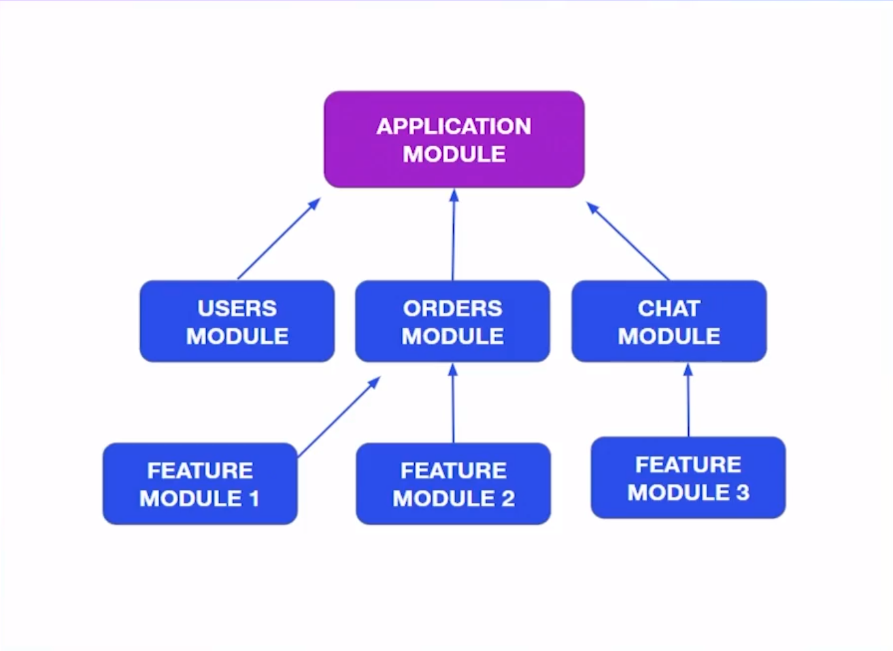

## Encapsular logica en modulos

La aplicación debería quedar organizada así:




Para crear controladores dentro de un modulo con el cli puedes usar esto:

```ts
nest g co controllers/users users
```

Entiendo que al modularizar por “Dominios” podemos ir facilmente a una arquitectura con microservicios 😄


Muy intersante. no estoy seguro si se pueda pasar a microservicios, tienes aun la dependencia del modulo principal. y los microservicios en realidad se comunican entre si por un message broker. esto es mas para no tener una inyeccion de dependencias por toda la aplicacion si solo la necesitas en un modulo. por ejemplo users no necesita en realidad el service de products


> La modularidad se refiere al proceso de dividir el sistema en varios módulos capa por capa de arriba a abajo cuando se resuelve un problema complejo

Dentro de cada carpeta crear las subcarpetas : controllers , entities, services, dtos

Decorador @Module que tiene 4 atributos: imports, controllers, providers y exports (este ultimo para conectar con otro modulo)

```ts
nest g mo modules/products --flat
nest g mo modules/users --flat
```
#### Así todos los módulos quedan dentro de la carpeta modules.

## Interaccion entre modulos

Para lograr usar el Servicio A que hace parte de Módulo A en el Módulo B debemos exportar el Servicio A y luego importar el  Módulo A en el Módulo B. 😮

Y Si alguna vez mientras desarrollan en NestJS y se encuentran con que a pesar de estar exportados e importados los módulos/servicios, y Nest les sigue pidiendo que los añadan, seguramente es porque ambos servicios están siendo llamados el uno al otro, en otras palabras, un círculo vicioso. Para esto Nest implementó la siguiente solución:

```ts

import { forwardRef } from '@nestjs/common';
import { ModuloUno } from 'modules/moduloUno.module';

@Module({
  imports: [
    forwardRef(() => ModuloUno), //? fordwardRef nos ayuda a que ambos servicios sean llamados recíprocamente
  ]})
Recuerden utilizar esto para ambos módulos, y también para ambos servicios.
```

Así quedaría cundo lo inyecten al servicio.

```ts
constructor(
	@Inject(forwardRef(() => ModuloUno))
	private moduloUno: ModuloUno,
) {}
```

El ejercicio real se haria con la entidad de customer, quienes son lo que clientes que hacen las compras. Ya que users en este caso serian mas como de tipo admin de la tienda.

Hola entiendo su punto de vista pero los users son todas las personas que haran uso de la app, que unos tengan permisos administrativos y otros no eso es otra cosa, pero un usuario administrador puede ser un customer y por tanto tener tambien ordenes de compras.


OTRO EJEMPLO:


Los módulos funcionan como islas que se encuentran aisladas, cada uno con sus controladores, services etc., en muchos casos vamos a necesitar que nuestros módulos se comuniquen entre si dependiendo de la lógica del negocio

> ¿Cómo comunicar módulos?
En el siguiente ejemplo vamos a comunicar el modulo de users con el modulo de products

> Entities
Para hacer uso de alguna entiti de otro modulo simplemente importamos la clase:

El el siguiente ejemplo exportamos la entidad Product que hace parte del modulo products en nuestra entidad order que hace parte del modulo de user


```ts
import { User } from './user.entity';
import { Product } from './../../products/entities/product.entity';

export class Order {
  date: Date;
  user: User;
  products: Product[];
}
```

> Services
Para hacer uso de algún servicio que no haga parte de los servicios de nuestro modulo, lo primero que debemos hacer es importar la clase en nuestro servicio:

En el siguiente ejemplo importamos la clase de ProductService en nuestra clase UserService

Luego debemos instanciarlo en el constructor de nuestra clase utilizando la inyección de dependencias, quedando de la siguiente manera;


```ts

import { ProductsService } from './../../products/services/products.service';

constructor(private productsService: ProductsService) {}
//Y luego en la clase en la cual necesitamos reutilizar un servicio de otro modulo lo llamamos:

getOrderByUser(id: number): Order {
    const user = this.findOne(id);
    return {
      date: new Date(),
      user,
      products: this.productsService.findAll(),
    };
  }
```

Si ejecutamos o probamos nuestro servicio, nos aparecerá un error en consola

El error que nos aparece en la terminal, básicamente nos esta diciendo que ProductServices hace parte de un modulo de ProductServices y no de UserServices lo que genera un problema de colisión.

Solución

Para solucionar este problema, debemos primero indicar en nuestro modulo de products que vamos a exportar nuestro productServices y asi cualquier modulo que lo necesite lo pueda utilizar sin ningún problema:


En nuestro products.module.ts:

```ts

@Module({
  controllers: [ProductsController, CategoriesController, BrandsController],
  providers: [ProductsService, BrandsService, CategoriesService],
	exports: [ProductsService]
})

//y luego en nuestro archivo user.module.ts importamos el modulo:

@Module({
  imports: [ProductsModule],
  controllers: [CustomerController, UsersController],
  providers: [CustomersService, UsersService],
})
```

Sin embargo además de los servicios también hago uso de Repositorios y son estos los que importo en otros módulos en donde los necesito, por ejemplo:

```ts
imports: [
	TypeOrmModule.forFeature([
		TuitionRepository,
		HealthWorkerRepository,
		CollegeRepository
	])
],
```

## Singleton 

Este patrón está incluido dentro de los STUPID principles (Singleton, Tight Coupling, Untestability, Premature Optimization, Indescriptive Naming, Duplication), que es lo opuesto a SOLID.

Incluso, el Singleton viola el OPEN/CLOSE principle.

[SINGLETON](https://platzi.com/clases/1630-mejor-codigo/22212-patrones-de-diseno-singleton/)

[Example](https://refactoring.guru/es/design-patterns/singleton/typescript/example)

> Entendiendo la inyección de dependecias

#### Patrón de Inyección de dependencias:

Es un principio de arquitectura donde nos permite desacoplar las cosas y simplemente un controlador por medio de su constructor puede decir que utiliza el servicio A o el servicio B

Un controlador puede inyectar mas de un servicio, tantos como quiera

#### Esto se logra a través del patrón singleton, lo que nos permite que una vez creada nuestra clase (servicio) la instancia de nuestro servicio se pueda utilizar para los demás controladores, sin necesidad de crear varias instancias del mismo servicio.

**Decorador @inyectable**

Para que lo anterior funcione en NestJS todos nuestros controladores deben tener el decorador @inyectable que le indica a nestJSque debe manejar esto como una dependencia y cumplir con el patrón singleton

Un servicio solo pertenece a un Modulo

#### Tratar de evitar la paradoja del huevo o la gallina


#### useValue y useClass

Cuando queremos que la instancia de una clase se comparta por todo un modulo debemos hacer 2 cosas.

Le colocamos el decorador @Inyectable a la clase
@Injectable() // <-- El decorador
```ts
export class ProductsService {
	// ...
}
//Y lo declaramos dentro del modulo correspondiente usando la sintaxis resumida
@Module({
  providers: [..., ProductsService], // Aqui por ejemplo
})
```
useClass

Internamente, nest js rescribe esta sintaxis de la siguiente forma:

```ts

@Module({
  providers: [
		{
			provide: ProducsService, // Nombre con el que haremos referencia a ella
			useClass: ProducsService // Nombre de la clase que se usara
		}
	], // Aqui por ejemplo
})
```

useValues

Además de poder inyectar clases también podemos inyectar valores. Esto es util para compartir valores que globales de la aplicación y evita que estos se guarden en memoria cada vez que se requieran.

```ts

const API_KEY = '12345634';
const API_KEY_PROD = 'PROD1212121SA';

@Module({
  imports: [...],
  controllers: [..],
  providers: [
    AppService,
    {
      provide: 'API_KEY', // Nombre con el que se hara referencia
      useValue: process.env.NODE_ENV === 'prod' ? API_KEY_PROD : API_KEY, // El valor
    },
  ],
})
export class AppModule {}
```
Para usar el valor solo debemos inyectarlo.

```ts


// src/app.service.ts
import { Injectable, Inject } from '@nestjs/common';

@Injectable()
export class AppService {
  constructor(@Inject('API_KEY') private apiKey: string) {} // 👈 Inject API_KEY
  getHello(): string {
    return `Hello World! ${this.apiKey}`;
  }
}
```

Al momento de ejecutar la app hay que ponele la variable de entorno.

```ts
NODE_ENV=prod npm run start:dev

```
Todas estas variables que se utilizan con useValue vendrian a ser las variables de entorno que en aplicaciones con express se almacenan en un archivo .env


[Techniques](https://docs.nestjs.com/techniques/configuration)


### useFactory 

Se recomienda no usar Use Factory para llamar a APIs porque dependerias de esta esperando a que responda AWAIT. Solo se llamo a API por cuestiones de aprendizaje. Se puede hacer el llamado por medio del HTTP Module. Si usar Use Factory para BD como Mongo DB

Ahora me parece que se usa algo diferente por algunas cosas que están **deprecated**. Siguiendo los warnings del editor me quedé con algo así, espero les sirva 😄

Por cierto, hay que instalar esta otra librería:

```ts
npm i rxjs
npm install  @nestjs/axios

import { HttpModule, HttpService } from '@nestjs/axios';
import { Module } from '@nestjs/common';
import { firstValueFrom } from 'rxjs';

@Module({
  imports: [HttpModule],
  providers: [{
    provide: 'TASKS',
    useFactory: async (http: HttpService) => {
      const response = http.get('https://jsonplaceholder.typicode.com/todos');
      const tasks = await firstValueFrom(response);
      return tasks.data;
    },
    inject: [HttpService],
  }],
})
```

```ts
//luego, el response de tipo “Observable” instanciado en la variable “tasks” se transforma en una promesa con el método “firstValueFrom()”, y pueden resolver la promesa como mejor les plazca, para continuar rápidamente instancié un Promise.resolve() así

import { Module } from '@nestjs/common';
import { HttpModule, HttpService } from '@nestjs/axios';
import { AppController } from './app.controller';
import { AppService } from './app.service';
import { ProductsModule } from './products/products.module';
import { UserModule } from './user/user.module';
import { firstValueFrom } from 'rxjs';

@Module({
  imports: [
    ProductsModule,
    UserModule,
    HttpModule.registerAsync({
      useFactory: () => ({
        timeout: 1000,
        maxRedirects: 5,
      }),
    }),
  ],
  controllers: [AppController],
  providers: [
    AppService,
    {
      provide: 'TASKS',
      inject: [HttpService],
      useFactory: async (http: HttpService) => {
        const tasks = await http.get(
          'https://jsonplaceholder.typicode.com/todos',
        );
        const value = Promise.resolve(firstValueFrom(tasks));
        return value;
      },
    },
  ],
})
export class AppModule {}
```

Actualmente es depreciado el HttpModule o HttpService’.
Para solucionarlo hay que instalar la siguiente dependecia:
```ts
npm i --save @nestjs/axios

//Importando

import { HttpModule, HttpService } from '@nestjs/axios';
```


### Resumen

> httpService
httpService nos permite hacer peticiones HTTP (get, post, put, delete, …). Esta libreria se basa en Axios (axios es una libreria de javascript para hacer peticiones http).

Uso de http
Para usar httpService debemos hacer 2 cosas

Declarar el modulo HttpModule dentro del modulo que usar el servicio

```ts

import { HttpModule } from '@nestjs/common';  // 👈 imports
@Module({
	imports: [HttpModule, ...], // 👈 
})
```

Inyectar el servicio en los providers del modulo que usara el servicio

```ts

import { HttpService } from '@nestjs/common';  // 👈 imports
...
@Injectable()
export class NameClass{
  constructor(private httpService: HttpService) {} // 👈 inyeccion
}

// Listo, ahora podremos usar el modulo
 nameOfFunction(): Observable<AxiosResponse<EntitiName[]>> {
    return this.httpService.get('url');
 }
```

> Introducción

Use factory permite crear valores dinámicamente. El valor real del provider ( sean valores, objetos, clases) será proporcionado por lo que se devuelva en una función fabricadora, aun si el valor se obtenga de forma asíncrona. La función fabricadora puede recibir parámetros.

Creacion del provider
```ts

// src/app.module.ts
import { Module, HttpModule, HttpService } from '@nestjs/common';  // 👈 imports

@Module({
  imports: [HttpModule, UsersModule, ProductsModule],
  controllers: [AppController],
  providers: [
    imports: [HttpModule, UsersModule, ProductsModule], // 👈 Se vuelven a importar los modul
    ...,
    {
      provide: 'TASKS',
      useFactory: async (http: HttpService) => { // 👈 implement useFactory
        const tasks = await http
          .get('https://jsonplaceholder.typicode.com/todos')
          .toPromise();
        return tasks.data;
      },
      inject: [HttpService], // Se inyecta los servicios que usara la funcion fabricadora
    },
  ],
})
export class AppModule {}
Uso del provider
```
  
src/app.service.ts
```ts

import { Injectable, Inject } from '@nestjs/common';

@Injectable()
export class AppService {
  constructor(
    @Inject('API_KEY') private apiKey: string,
    @Inject('TASKS') private tasks: any[], // 👈 inject TASKS
  ) {}
  getHello(): string {
    console.log(this.tasks); // 👈 print TASKS
    return `Hello World! ${this.apiKey}`;
  }
}
```

## Global module

Un modulo global será instanciado en todos los demás módulos si que nosotros tengamos que hacerlo explícitamente.

Creando un modulo global
Para ello creamos un modulo

```ts
nest g mo database
```

Al modulo le agregaremos el decorador global

```ts

@Global() // Aqui
@Module({})
export class ProductsModule {}
Ahora podemos agregar todos los controladores, modulos y providers que necesitemos
import { Module, Global } from '@nestjs/common';

const API_KEY = '12345634';
const API_KEY_PROD = 'PROD1212121SA';

@Global()
@Module({
  providers: [
    {
      provide: 'API_KEY',
      useValue: process.env.NODE_ENV === 'prod' ? API_KEY_PROD : API_KEY,
    },
  ],
  exports: ['API_KEY'],
})
export class DatabaseModule {}
```
y agregaremos el modulo global al app.module.ts
// src/app.module.ts

```ts
import { DatabaseModule } from './database/database.module';

@Module({
  imports: [
    DatabaseModule // 👈 Use DatabaseModule like global Module
   ], 
})
export class AppModule {}
```
Listo, ahora podremos usar todos los controladores, modulos y providers que fueron declarados en el modulo global sin tener que instanciar el modulo DatabaseModule en los modulos que se requieran

// src/users/services/users.service.ts

```ts
import { Injectable, NotFoundException, Inject } from '@nestjs/common';

@Injectable()
export class UsersService {
  constructor(
    private productsService: ProductsService,
    @Inject('API_KEY') private apiKey: string, // 👈 Inject API_KEY
  ) {}
}
```

## Config Module

El valor de las variables de entorno (las variables de entorno son variables globales que se usan en toda la aplicación) depende de si la aplicación se ejecutara en el servidor de producción, en el de pruebas o en una versión local.

Instalación
Para manejar las variables de entorno instalaremos el modulo config propio de nest js.

```ts
npm i --save @nestjs/config
```

> Declaración de variables entorno

Debemos listar todas las variables de entorno en un archivo llamado .env en la raíz del proyecto.

```ts
// .env
DATABASE_NAME=my_db
API_KEY='1234'
```

No olvides agregar este archivo en lista de los ignore de git

```ts
// .gitignore
*.env
```


Usar el paquete config
```ts
// src/app.module.ts
import { ConfigModule } from '@nestjs/config';

@Module({
  imports: [
    ConfigModule.forRoot({ // 👈 Implement ConfigModule
      envFilePath: '.env',
      isGlobal: true,
    }),
    ...
  ],
})
export class AppModule {}
```


Usar las variables de entorno

```ts
// src/users/services/users.service.ts
import { ConfigService } from '@nestjs/config';
...

@Injectable()
export class UsersService {
  constructor(
    private productsService: ProductsService,
    private configService: ConfigService, // 👈 inject ConfigService
  ) {}

  findAll() {
    const apiKey = this.configService.get('API_KEY'); // 👈 get API_KEY
    const dbName = this.configService.get('DATABASE_NAME');  // 👈 get DATABASE_NAME
    console.log(apiKey, dbName);
    return this.users;
  }
}
```

.gitignore

Siempre ignorar informacion sensible

```ts
.env
API_KEY = 1234
DATABASE_NAME = my_db
```

l valor de las variables de entorno (las variables de entorno son variables globales que se usan en toda la aplicación) depende de si la aplicación se ejecutara en el servidor de producción, en el de pruebas o en una versión local.

Instalación
Para manejar las variables de entorno instalaremos el modulo config propio de nest js.

```ts

npm i --save @nestjs/config

```

Declaración de variables entorno
Debemos listar todas las variables de entorno en un archivo llamado .env en la raíz del proyecto.

```ts
// .env
DATABASE_NAME=my_db
API_KEY='1234'
No olvides agregar este archivo en lista de los ignore de git
// .gitignore
*.env
```

Usar el paquete config
// src/app.module.ts

```ts
import { ConfigModule } from '@nestjs/config';

@Module({
  imports: [
    ConfigModule.forRoot({ // 👈 Implement ConfigModule
      envFilePath: '.env',
      isGlobal: true,
    }),
    ...
  ],
})
export class AppModule {}

Usar las variables de entorno
// src/users/services/users.service.ts
import { ConfigService } from '@nestjs/config';
```

```ts
@Injectable()
export class UsersService {
  constructor(
    private productsService: ProductsService,
    private configService: ConfigService, // 👈 inject ConfigService
  ) {}

  findAll() {
    const apiKey = this.configService.get('API_KEY'); // 👈 get API_KEY
    const dbName = this.configService.get('DATABASE_NAME');  // 👈 get DATABASE_NAME
    console.log(apiKey, dbName);
    return this.users;
  }

}

```
### Configuracion por ambientes


Crear archivos env para los distintos ambientes
Ya que configuramos el archivo env que contiene el valor de las variables de entorno para el servidor de desarrollo debemos crear los archivos .env para el servidor de pruebas y produccion.

```ts
// .stag.env
DATABASE_NAME=my_db_stag
API_KEY=333
```

```ts
// .prod.env
DATABASE_NAME=my_db_prod
API_KEY=999
```

> ¿Cómo elegir dinámicamente el archivo env?

Nuestro código debe elegir automáticamente que archivo .env debe tomar según en el servidor en el que se este ejecutando. Para ello debemos crear un objeto en donde listaremos todos los ambientes que existen y los ligaremos con su archivo correspondiente.

```ts

// src/enviroments.ts
export const enviroments = {
  dev: '.env',
  stag: '.stag.env',
  prod: '.prod.env',
};
```

Ahora solo debemos agregar la linea mágica para que el archivo .env correspondiente se inyecte en el código.

// src/app.module.ts

```ts

import { enviroments } from './enviroments'; // 👈

@Module({
  imports: [
    ConfigModule.forRoot({
      envFilePath: enviroments[process.env.NODE_ENV] || '.env', // 👈
      isGlobal: true,
    }),
    ...
  ],
  ...
})
export class AppModule {}
```
Llamar a las variables de entorno
Listo, ahora solo debemos preocuparnos por obtener las variables de entorno.

```ts

// src/app.service.ts
import { ConfigService } from '@nestjs/config'; // 👈

@Injectable()
export class AppService {
  constructor(
    @Inject('TASKS') private tasks: any[],
    private config: ConfigService,  // 👈
  ) {}
  getHello(): string {
    const apiKey = this.config.get<string>('API_KEY');  // 👈
    const name = this.config.get('DATABASE_NAME');  // 👈
    return `Hello World! ${apiKey} ${name}`;
  }
}
```

Especificar ambiente
Podemos indicar en que ambiente se esta trabajando usando las siguientes lineas.

```ts

NODE_ENV=prod npm run start:dev
NODE_ENV=stag npm run start:dev
Si estas usando el powershell de windos

$env:NODE_ENV="prod"; npm run start:dev
$env:NODE_ENV="stag"; npm run start:dev
$env:NODE_ENV="dev"; npm run start:dev
```

En mi caso, ejecutando en windows, para asignar la variable de entorno al ejecutar hago lo siguiente:

```ts
set NODE_ENV=stag && npm run start:dev
```


### En mi caso puse el NODE_ENV=dev en el script de start:dev quedandome

```ts
"start:dev": "cross-env NODE_ENV=dev nest start --watch"
```
cross-env es una dependencia que me permite declarar variables desde la consola de windows

En caso tal estés usando docker compose para correr tu proyecto y tienes problemas con el cambio de ambiente, revisa la opción env_file. Si estás pasando determinado archivo en esa opción, tomará siempre esas variables de entorno.


👋
Ya que no se sube el archivo .env a nuestro repositorio ni se trackea, es importante dar una documentacion de que se tiene alli pero sin especificar sus valores.
Para ellos cambiamos un poco la especificacion del .gitignore para no ignore todos los archivos terminados en .env sino solo .env

```ts
// .gitignore
# Enviroments
*.env
!.example.env
```

Y agregamos a la raiz un example.env donde iran las mismas variables pero sin su respectivo valor

```ts

API_KEY=
DATABASE_NAME=
```
Siempre se tiene que usar @Entity en el caso de la clase aún no creamos la tabla de órdenes de compra así no hemos llegado a ese punto, pero siempre que tengas una clase y este representa una tabla en tu DB debes usar @Entity.
